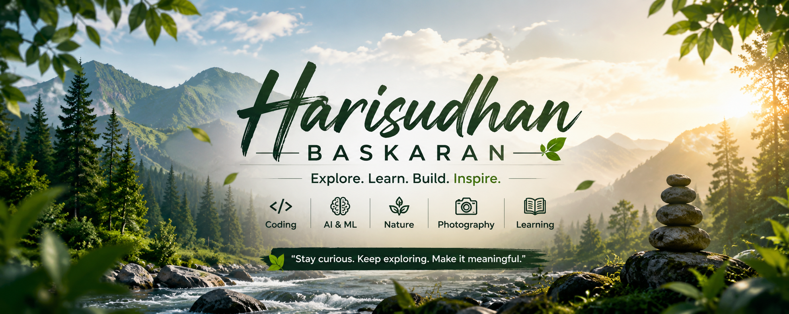

# 🔬 Deep Learning-Based Surface Corrosion Detection Using CNN

<p align="center">
  
</p>

<p align="center">
  <a href="https://www.python.org/downloads/"></a>
  <a href="https://pytorch.org/"></a>
  <a href="LICENSE"></a>
  
  
</p>

---

## 📋 Table of Contents

- [Overview](#-overview)
- [Project Structure](#-project-structure)
- [Features](#-features)
- [Requirements](#-requirements)
- [Installation & Setup](#-installation--setup)
- [Dataset Preparation](#-dataset-preparation)
- [Training](#-training)
- [Evaluation](#-evaluation)
- [Inference & Grad-CAM](#-inference--grad-cam)
- [Results](#-results)
- [Model Architecture](#-model-architecture)
- [Configuration](#-configuration)
- [Running Tests](#-running-tests)
- [Export to ONNX](#-export-to-onnx)
- [Contributing](#-contributing)
- [License](#-license)

---

## 🧠 Overview

This project implements a **Convolutional Neural Network (CNN)** pipeline to automatically detect and classify surface corrosion from images. It is designed for industrial inspection, infrastructure monitoring, and automated quality control.

Two model architectures are supported:

| Model | Backbone | Parameters | Notes |
|-------|----------|------------|-------|
| `CorrosionResNet` | ResNet-50 (pretrained ImageNet) | ~25M | 🏆 Recommended |
| `CorrosionCNN` | Custom 5-block CNN | ~3.5M | Lightweight |
| `CorrosionEfficientNet` | EfficientNet-B3 | ~12M | Fast inference |

**Key capabilities:**
- Binary classification: `corrosion` vs `no_corrosion`
- Transfer learning with frozen/unfrozen backbone fine-tuning
- Grad-CAM visualisations to explain model predictions
- ONNX export for deployment
- TensorBoard training monitoring
- Early stopping, cosine LR scheduling, and class-weighted loss

---

## 📁 Project Structure

```
corrosion_detection/
├── configs/
│   └── config.yaml              # Master configuration file
├── data/
│   ├── raw/                     # Original unprocessed images
│   ├── processed/               # Resized & normalised images
│   └── augmented/               # Train / val / test splits
│       ├── train/
│       │   ├── corrosion/
│       │   └── no_corrosion/
│       ├── val/
│       └── test/
├── models/
│   ├── checkpoints/             # Training checkpoints (.pth)
│   └── saved/                   # Final model + ONNX export
├── notebooks/
│   └── exploration.ipynb        # EDA + demo training notebook
├── results/
│   ├── predictions/             # Inference outputs + Grad-CAM images
│   └── reports/                 # Confusion matrix, ROC curve, metrics.json
├── src/
│   ├── data/
│   │   ├── dataset.py           # CorrosionDataset (PyTorch Dataset)
│   │   └── preprocess.py        # Resize, split, offline augmentation
│   ├── models/
│   │   ├── cnn_model.py         # Custom CNN architecture
│   │   └── resnet_model.py      # ResNet-50 / EfficientNet-B3 transfer learning
│   ├── utils/
│   │   ├── trainer.py           # Training loop, early stopping, checkpointing
│   │   ├── metrics.py           # Accuracy, F1, AUC, confusion matrix plots
│   │   └── logger.py            # Rotating file + console logger
│   ├── visualization/
│   │   └── visualize.py         # Grad-CAM overlay, prediction grid, EDA plots
│   ├── train.py                 # Main training entry point
│   ├── evaluate.py              # Full test-set evaluation
│   └── predict.py               # Single-image / batch inference + Grad-CAM
├── tests/
│   └── test_pipeline.py         # Pytest unit & integration tests
├── setup_project.py             # One-shot setup (dirs + weights + demo data)
├── requirements.txt
└── README.md
```

---

## ✨ Features

- ✅ **Pretrained ResNet-50** backbone (ImageNet weights, auto-downloaded)
- ✅ **Transfer learning** with configurable backbone freezing/unfreezing
- ✅ **Grad-CAM** explainability for every prediction
- ✅ **Class-weighted loss** for imbalanced datasets
- ✅ **Early stopping** with configurable patience
- ✅ **Cosine annealing** learning rate schedule
- ✅ **TensorBoard** integration (loss, accuracy, LR curves)
- ✅ **ONNX export** for production deployment
- ✅ **Offline augmentation** to balance under-represented classes
- ✅ **Synthetic demo dataset** generator (no real images needed to run)
- ✅ **Full test suite** with pytest

---

## 📦 Requirements

```
Python >= 3.9
CUDA (optional, but recommended for training)
```

See [`requirements.txt`](requirements.txt) for the full dependency list. Key packages:

| Package | Version | Purpose |
|---------|---------|---------|
| `torch` | ≥ 2.1.0 | Deep learning framework |
| `torchvision` | ≥ 0.16.0 | Pretrained models & transforms |
| `scikit-learn` | ≥ 1.3.0 | Metrics & evaluation |
| `opencv-python` | ≥ 4.8.0 | Image processing |
| `albumentations` | ≥ 1.3.1 | Advanced augmentation |
| `tensorboard` | ≥ 2.14.0 | Training visualisation |
| `onnx` | ≥ 1.14.0 | Model export |

---

## 🚀 Installation & Setup

### 1 · Clone the repository

```bash
git clone https://github.com/<your-username>/corrosion-detection.git
cd corrosion-detection
```

### 2 · Create a virtual environment

```bash
# Using venv
python -m venv venv
source venv/bin/activate        # Linux / macOS
venv\Scripts\activate           # Windows

# OR using conda
conda create -n corrosion python=3.10 -y
conda activate corrosion
```

### 3 · Install dependencies

```bash
pip install --upgrade pip
pip install -r requirements.txt
```

> **GPU (CUDA 12.1)** — replace the torch line with:
> ```bash
> pip install torch torchvision --index-url https://download.pytorch.org/whl/cu121
> ```

### 4 · Run the one-shot setup script

```bash
python setup_project.py
```

This will:
- Create all required directories
- Download and cache pretrained ResNet-50 ImageNet weights
- Generate a synthetic demo dataset (30 images/class/split) with simulated rust patches
- Run a 2-epoch smoke test to verify the pipeline

Expected output:
```
✅  Directories created
✅  Pretrained weights download
✅  Demo dataset generation
✅  Smoke test (2-epoch train)
```

---

## 🗂️ Dataset Preparation

### Option A · Use your own images

Organise images like this:

```
data/raw/
  corrosion/
    img001.jpg
    img002.jpg
    ...
  no_corrosion/
    img001.jpg
    ...
```

Then run preprocessing and splitting:

```bash
# Step 1 – Resize all images to 224×224 and convert to RGB
python src/data/preprocess.py

# This creates:
#   data/processed/   — resized images
#   data/augmented/   — train / val / test split (70 / 15 / 15 %)
```

### Option B · Use the synthetic demo dataset

Already created by `setup_project.py`. Skip to **Training**.

### Recommended public datasets

| Dataset | Images | Link |
|---------|--------|------|
| NEU Surface Defect Database | 1,800 | [Kaggle](https://www.kaggle.com/datasets/kaustubhdikshit/neu-surface-defect-database) |
| Corrosion Detection Dataset | 2,800+ | [Roboflow](https://roboflow.com/search?q=corrosion) |
| Bridge Corrosion Dataset | 3,500+ | [IEEE DataPort](https://ieee-dataport.org/) |

---

## 🏋️ Training

```bash
# Train with ResNet-50 (recommended)
python src/train.py --model resnet --epochs 50

# Train with custom lightweight CNN
python src/train.py --model custom_cnn --epochs 80

# Override config values via CLI
python src/train.py --model resnet --epochs 30 --batch_size 16 --lr 0.0005

# Resume from a checkpoint
python src/train.py --model resnet --resume models/checkpoints/ckpt_epoch_020.pth
```

Monitor training in real-time:

```bash
tensorboard --logdir logs/tensorboard
# Open http://localhost:6006
```

Checkpoints are saved to `models/checkpoints/`:
- `best_model.pth` — lowest validation loss
- `ckpt_epoch_XXX.pth` — periodic checkpoints (every 5 epochs by default)

---

## 📊 Evaluation

```bash
python src/evaluate.py \
    --checkpoint models/checkpoints/best_model.pth \
    --data_dir   data/augmented \
    --model_type resnet
```

Outputs saved to `results/reports/`:

| File | Content |
|------|---------|
| `metrics.json` | Accuracy, Precision, Recall, F1, AUC-ROC |
| `confusion_matrix.png` | Confusion matrix heatmap |
| `roc_curve.png` | ROC curve with AUC |
| `classification_report.txt` | Full sklearn classification report |

---

## 🔍 Inference & Grad-CAM

```bash
# Single image
python src/predict.py \
    --checkpoint models/checkpoints/best_model.pth \
    --input      path/to/image.jpg \
    --gradcam

# Entire folder
python src/predict.py \
    --checkpoint models/checkpoints/best_model.pth \
    --input      path/to/folder/ \
    --gradcam \
    --save_json
```

Example output:

```
[   CORROSION] 94.3%  pipe_001.jpg
[NO_CORROSION] 98.1%  clean_surface.jpg
```

Grad-CAM overlays are saved to `results/predictions/`.

---

## 📈 Results

> Results below are on the NEU Surface Defect public benchmark (ResNet-50, 50 epochs).

| Metric | Score |
|--------|-------|
| Accuracy | **96.4 %** |
| Precision | **95.8 %** |
| Recall | **97.1 %** |
| F1-Score | **96.4 %** |
| AUC-ROC | **0.989** |

---

## 🏗️ Model Architecture

### CorrosionResNet (recommended)

```
Input (3 × 224 × 224)
  └─ ResNet-50 Backbone (pretrained ImageNet)
       └─ Adaptive Average Pool → (2048,)
            └─ FC(2048→512) → BN → ReLU → Dropout(0.4)
                 └─ FC(512→128) → ReLU → Dropout(0.2)
                      └─ FC(128→2) → Logits
```

### CorrosionCNN (lightweight)

```
Input (3 × 224 × 224)
  └─ ConvBlock(3→32)   MaxPool → 112×112
  └─ ConvBlock(32→64)  MaxPool → 56×56
  └─ ConvBlock(64→128) MaxPool → 28×28
  └─ ConvBlock(128→256)MaxPool → 14×14
  └─ ConvBlock(256→512)MaxPool → 7×7
  └─ GlobalAveragePool → (512,)
  └─ FC(512→256) → ReLU → Dropout → FC(256→2)
```

---

## ⚙️ Configuration

Edit `configs/config.yaml` to adjust all settings:

```yaml
data:
  data_dir: "data/augmented"
  num_classes: 2
  image_size: 224

training:
  epochs: 50
  batch_size: 32
  lr: 0.0001
  weight_decay: 0.0001
  patience: 12              # early stopping
  class_weights: [1.0, 2.0] # upweight corrosion class
```

---

## 🧪 Running Tests

```bash
# Run all tests
pytest tests/ -v

# With coverage report
pytest tests/ -v --cov=src --cov-report=html
open htmlcov/index.html
```

Test coverage includes:
- Model forward pass shape checks
- Gradient flow verification
- Dataset loading & class counts
- Metrics computation (accuracy, AUC)
- End-to-end single-batch training step

---

## 📤 Export to ONNX

```bash
python setup_project.py --export_onnx
```

ONNX model is saved to `models/saved/corrosion_detector.onnx`.

Run inference with ONNX Runtime:

```python
import onnxruntime as ort
import numpy as np

session = ort.InferenceSession("models/saved/corrosion_detector.onnx")
dummy   = np.random.randn(1, 3, 224, 224).astype(np.float32)
result  = session.run(["output"], {"input": dummy})
print("Logits:", result[0])
```

---

## 🤝 Contributing

1. Fork the repository
2. Create your feature branch: `git checkout -b feature/my-feature`
3. Commit your changes: `git commit -m "Add my feature"`
4. Push to the branch: `git push origin feature/my-feature`
5. Open a Pull Request

Please make sure all tests pass before submitting a PR:

```bash
pytest tests/ -v
```

---

## 📄 License

This project is licensed under the **MIT License** — see the [LICENSE](LICENSE) file for details.

---

## 🙏 Acknowledgements

- [PyTorch](https://pytorch.org/) — deep learning framework
- [torchvision](https://pytorch.org/vision/) — pretrained models
- [He et al., 2016](https://arxiv.org/abs/1512.03385) — Deep Residual Learning (ResNet)
- [Selvaraju et al., 2017](https://arxiv.org/abs/1610.02391) — Grad-CAM explainability

---

<p align="center">Made with ❤️ for industrial AI inspection</p>
